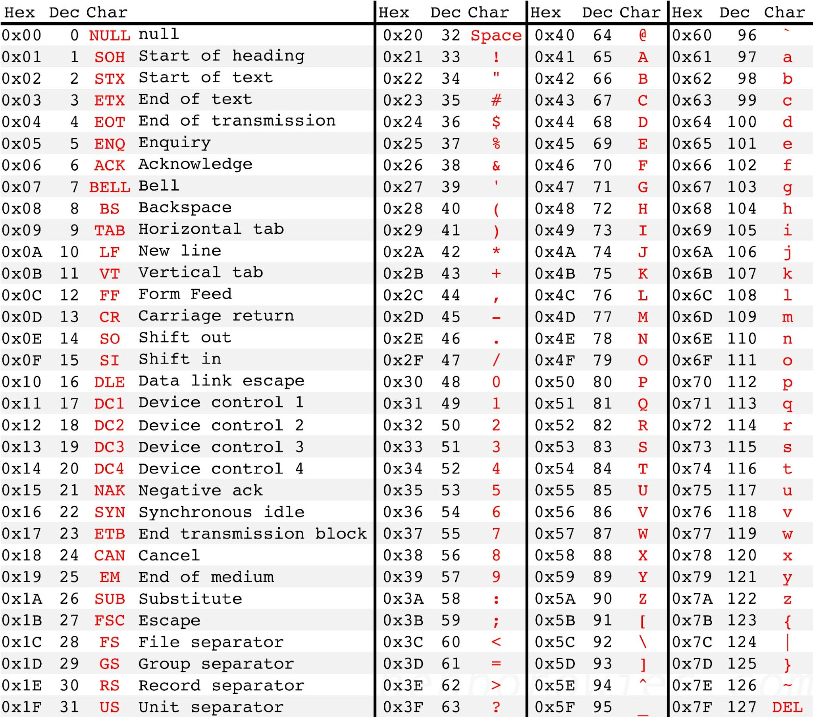

# LiveHack 3 Practice - Data Encryption



As stated in CodeHS Lesson 3.6, the single symble data type, `char` are actually numbers.  This is a little more clear when looking at an ASCII Table and knowing what numbers map to what chars.  Knowing this, we could do interesting things like add numbers to char values to get to get other char values.  

For example:
```
char chr1 = 'a';
char chr2 = (char)(chr1 + 3);
System.out.println("Adding 3 to '"+chr1+"' is '" + chr2 + "'");
```
outputs
```
Adding 3 to 'a' is 'd'
```

With this in mind, one could write a program to encrypt a message by "shifting"  the characters of a message by a certain amount and decrypt the encrypted message by reversing the shift.  For example, the message **"Meet me at noon"** could be encrypted to **"Phhw#ph#dw#qrrq"** by adding 3 to each character, hence converting each character in the message to a character 3 spots down in the ascii table above.

One issue is that not all symbols on the ascii table are suitable, so one could limit the usable characters in an encrypted message to be from the space character (character 32) to ~ (character 126).  Between them there are 95 characters to work.  With this in mind, a formula to encrypt a character could be:
 ```
 (char)(' ' + ((message.charAt(i) - ' ' + shift) % 95))
 ```
Where `shift` is the amount to shift a character at position `i`.  For example, if we wanted to encrypt the message `Why not?` with a shift of 10 using the above formula, it would encrypt to `ar$*xy~I`.  Note that for the letter `y`, the shift wraps around to the front of the set of usable characters and results in `$` after encryption.

Here are some more encrypted strings using this method:
```
ABC (shift 10) --> KLM
pizza (shift 5) --> un  f
Cat (shift 15) --> Rp$
```

## Problem

1. In Encryption.java, define a method `encryptMessage` that takes in via parameter variables the message (string) to encrypt and a shift amount (integer).  `encryptMessage` will return a string of the message encrypted following the formula above.  Be sure to include a javadoc comment with the method definition.

2.  In the `run()` method, write a program that gets a message from the user and outputs the encrypted message, utilizing the `encryptMessage` method.


#### Sample Run 1
```
**** Encryption Program *****
Enter the message to encrypt: This is a secret
Enter the shift amount: 5
Here is your encrypted message: Ymnx%nx%f%xjhwjy
```
#### Sample Run 2
```
**** Encryption Program *****
Enter the message to encrypt: Don't tell anyone
Enter the shift amount: 5
Here is your encrypted message: Its,y%yjqq%fs~tsj
```
 


